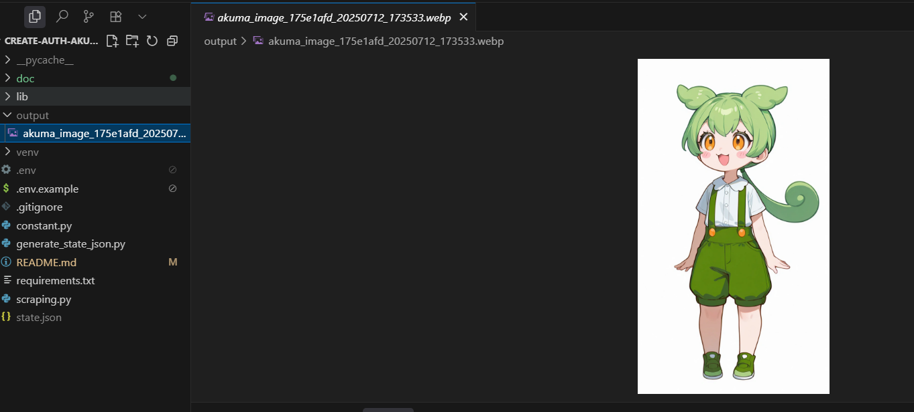
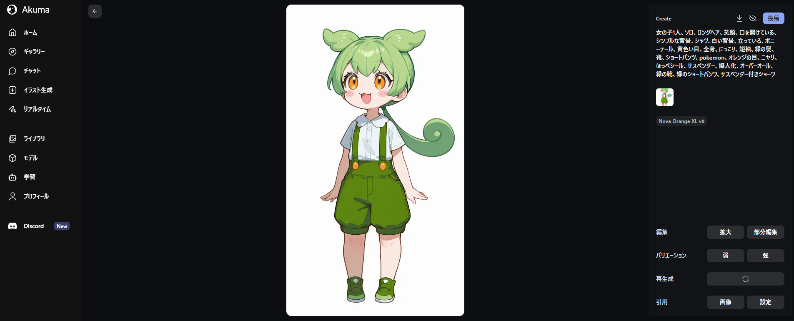
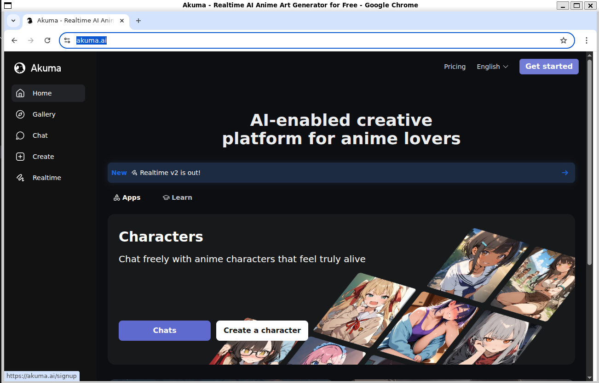
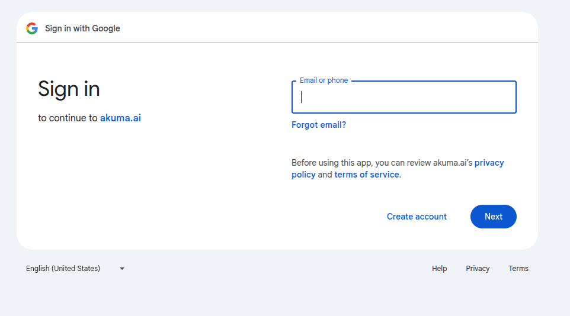
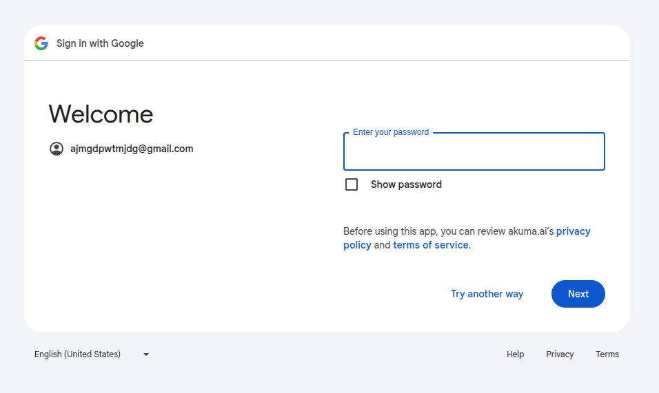
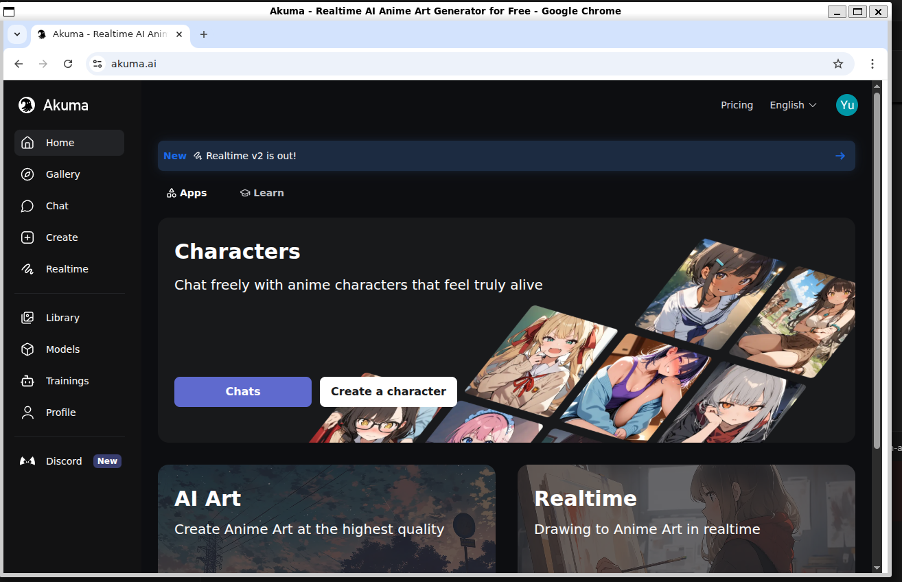
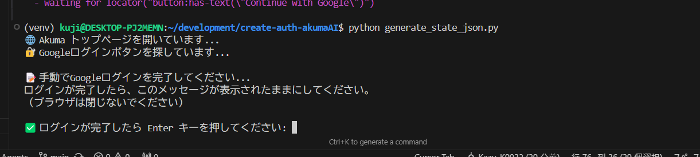
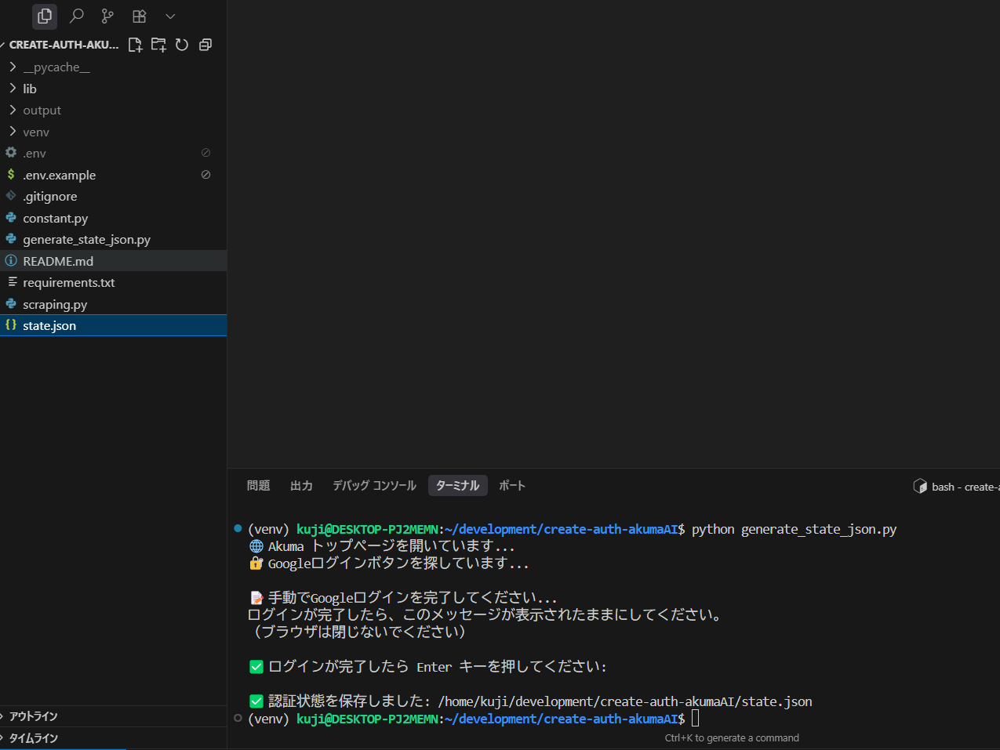

# CreateAuthAkumaAI

akuma.ai の認証ファイルを作成するリポジトリ
2025.07.12時点だと生成したイラスト情報を取得できる公式APIが存在せず、プログラムから画像やタグ情報を取得できない問題があった。
この問題をplaywright/Chromiumを使って認証ファイルを生成することで対応した。

## 機能紹介(2025.07.12時点)

環境変数に定義したリンクを元に、画像とタグ情報を取得
```bash
~$: python scraping.py
画像URL: https://storage.googleapis.com/output-image-bucket-409dc27e/e27d1ce6-f450-42ee-89f6-dec6af08358d.webp
説明文: 女の子1人、ソロ、ロングヘア、笑顔、口を開けている、シンプルな背景、シャツ、白い背景、立っている、ポニーテール、黄色い目、全身、にっこり、短袖、緑の髪、靴、ショートパンツ、pokemon、オレンジの目、ニヤリ、ほっぺシール、サスペンダー、擬人化、オーバーオール、緑の靴、緑のショートパンツ、サスペンダー付きショーツ
画像を保存しました: output/akuma_image_175e1afd_20250712_173533.webp
```



## セットアップ手順

### 手順1: Python3 のインストール

#### Ubuntu/Debian (WSL2 含む)

```bash
# システムパッケージの更新
sudo apt update

# Python3とpip3のインストール
sudo apt install python3 python3-pip python3-venv

# バージョン確認
python3 --version
pip3 --version
```

#### macOS

```bash
# Homebrewを使用
brew install python3

# または公式インストーラーを使用
# https://www.python.org/downloads/macos/
```

#### Windows

```bash
# 公式インストーラーを使用
# https://www.python.org/downloads/windows/
# インストール時に「Add Python to PATH」にチェックを入れる
```

### 手順2: 依存関係の確認

```bash
# Python3が利用可能か確認
python3 --version

# pip3が利用可能か確認
pip3 --version

# venvモジュールが利用可能か確認
python3 -m venv --help
```

### 手順3: リポジトリのクローン

```bash
git clone <repository-url> create-auth-akumaAI
cd create-auth-akumaAI
```

### 手順4: 仮想環境の作成

```bash
# 仮想環境を作成
python3 -m venv venv

# 仮想環境をアクティベート
## Ubuntu/Debian/macOS の場合
source venv/bin/activate

## Windows の場合
venv\Scripts\activate
```

### 手順5: 依存関係のインストール

```bash
# pipを最新版にアップグレード
pip install --upgrade pip

# requirements.txtからすべてのパッケージをインストール
pip install -r requirements.txt
```

### 手順6: Playwright のセットアップ

```bash
# Playwrightのブラウザをインストール
playwright install chromium
```

### 手順7: 環境変数の設定

```bash
# .env.exampleファイルをコピー
cp .env.example .env
```

### 手順8: 環境変数の設定

AKUMA_JOB_URLには、akuma.aiの作成画像の詳細画面のリンクを設置

```.env.example
AKUMA_JOB_URL=https://akuma.ai/jobs/xxxxx?image=xxxxx
```

▼例
```.env.example
AKUMA_JOB_URL=https://akuma.ai/jobs/175e1afd-7c76-470c-a8bc-915d044f74e9?image=e27d1ce6-f450-42ee-89f6-dec6af08358d
```


## リポジトリの使用

### 機能1: 認証ファイルの生成

```bash
# 仮想環境をアクティベート
source venv/bin/activate

# 認証ファイルを生成
python generate_state_json.py
```

1. **ブラウザが生成されるので認証を行う**
    - 
    - 
    - 
    - 
    - 
2. **ターミナルに戻り、Enterを押すと、state.jsonが生成される**
    - 
    - 

### 機能2: Akuma URLから画像のダウンロードとタグ情報の取得

※認証ファイルを生成している必要があります。

```bash
# 仮想環境をアクティベート
source venv/bin/activate

# スクレイピング実行
python scraping.py
```

環境変数に定義したリンクを元に、画像とタグ情報を取得
```bash
~$: python scraping.py
画像URL: https://storage.googleapis.com/output-image-bucket-409dc27e/e27d1ce6-f450-42ee-89f6-dec6af08358d.webp
説明文: 女の子1人、ソロ、ロングヘア、笑顔、口を開けている、シンプルな背景、シャツ、白い背景、立っている、ポニーテール、黄色い目、全身、にっこり、短袖、緑の髪、靴、ショートパンツ、pokemon、オレンジの目、ニヤリ、ほっぺシール、サスペンダー、擬人化、オーバーオール、緑の靴、緑のショートパンツ、サスペンダー付きショーツ
画像を保存しました: output/akuma_image_175e1afd_20250712_173533.webp
```

