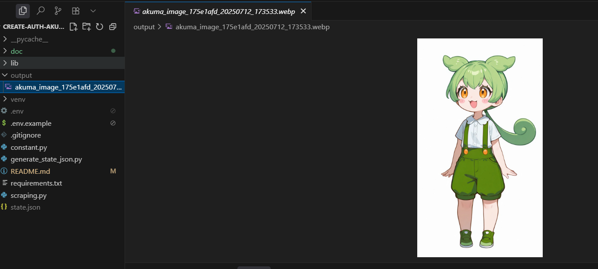
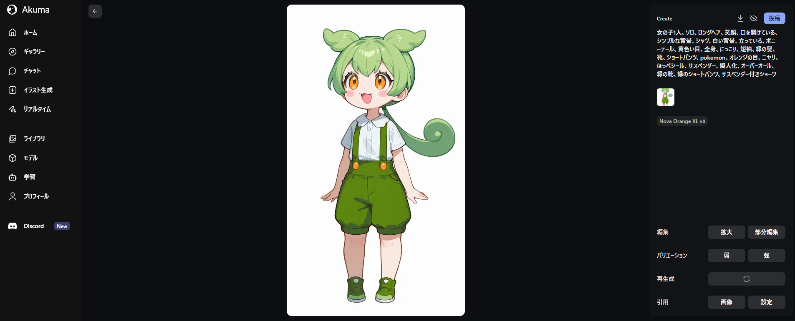
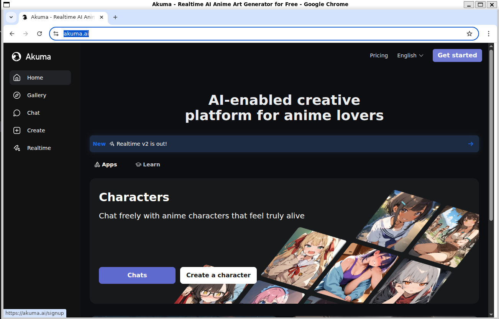
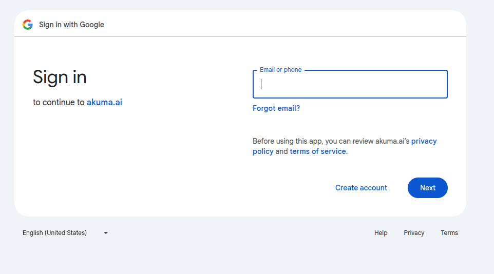
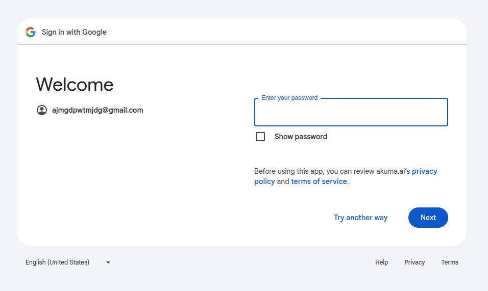
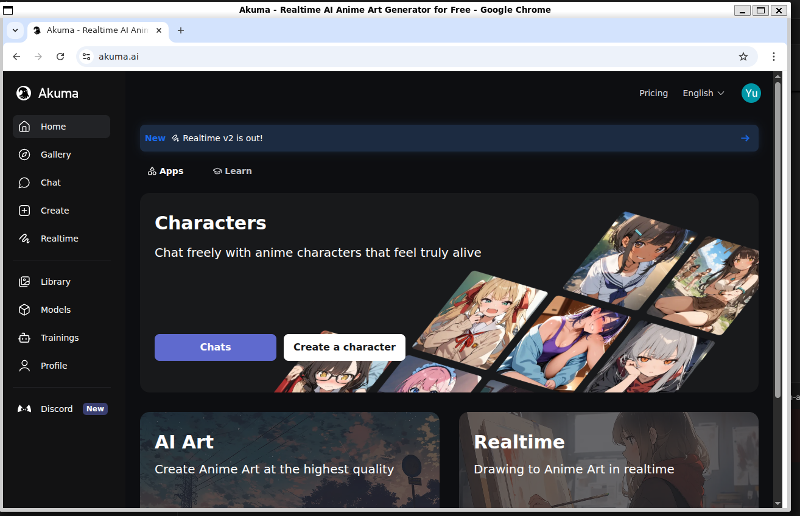
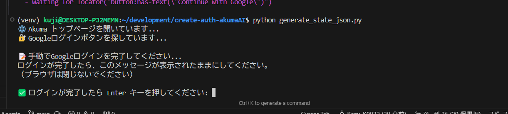
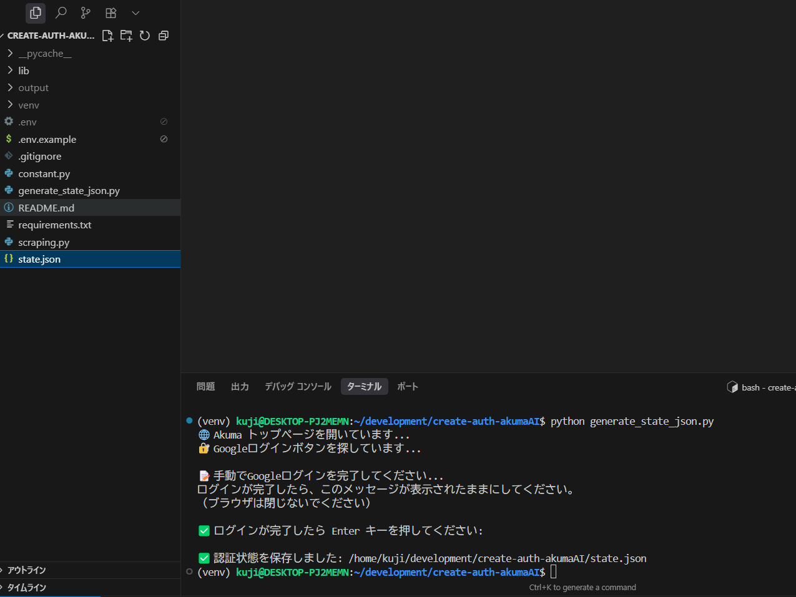

# CreateAuthAkumaAI

[日本語](../../README.md) | English

Repository for creating authentication files for akuma.ai.

As of 2025.07.12, there was no official API to retrieve generated illustration information, and there was a problem that images and tag information could not be obtained programmatically.

This issue was addressed by generating authentication files using playwright/Chromium.

## Feature Introduction (as of 2025.07.12)

Retrieve images and tag information based on links defined in environment variables

```bash
~$: python scraping.py
Image URL: https://storage.googleapis.com/output-image-bucket-409dc27e/e27d1ce6-f450-42ee-89f6-dec6af08358d.webp
Description: 1 girl, solo, long hair, smiling, mouth open, simple background, shirt, white background, standing, ponytail, yellow eyes, full body, grinning, short sleeves, green hair, shoes, shorts, pokemon, orange eyes, smirk, cheek sticker, suspenders, anthropomorphized, overalls, green shoes, green shorts, shorts with suspenders
Image saved: output/akuma_image_175e1afd_20250712_173533.webp
```



## Setup Instructions

### Step 1: Install Python3

#### Ubuntu/Debian (including WSL2)

```bash
# Update system packages
sudo apt update

# Install Python3 and pip3
sudo apt install python3 python3-pip python3-venv

# Check versions
python3 --version
pip3 --version
```

#### macOS

```bash
# Using Homebrew
brew install python3

# Or use the official installer
# https://www.python.org/downloads/macos/
```

#### Windows

```bash
# Use the official installer
# https://www.python.org/downloads/windows/
# Check "Add Python to PATH" during installation
```

### Step 2: Verify Dependencies

```bash
# Check if Python3 is available
python3 --version

# Check if pip3 is available
pip3 --version

# Check if venv module is available
python3 -m venv --help
```

### Step 3: Clone the Repository

```bash
git clone <repository-url> create-auth-akumaAI
cd create-auth-akumaAI
```

### Step 4: Create Virtual Environment

```bash
# Create virtual environment
python3 -m venv venv

# Activate virtual environment
## For Ubuntu/Debian/macOS
source venv/bin/activate

## For Windows
venv\Scripts\activate
```

### Step 5: Install Dependencies

```bash
# Upgrade pip to latest version
pip install --upgrade pip

# Install all packages from requirements.txt
pip install -r requirements.txt
```

### Step 6: Setup Playwright

```bash
# Install Playwright browsers
playwright install chromium
```

### Step 7: Configure Environment Variables

```bash
# Copy .env.example file
cp .env.example .env
```

### Step 8: Set Environment Variables

Set the AKUMA_JOB_URL to the link of the akuma.ai created image detail screen

```.env.example
AKUMA_JOB_URL=https://akuma.ai/jobs/xxxxx?image=xxxxx
```

▼Example

```.env.example
AKUMA_JOB_URL=https://akuma.ai/jobs/175e1afd-7c76-470c-a8bc-915d044f74e9?image=e27d1ce6-f450-42ee-89f6-dec6af08358d
```



## Using the Repository

### Feature 1: Generate Authentication Files

```bash
# Activate virtual environment
source venv/bin/activate

# Generate authentication files
python generate_state_json.py
```

1. **A browser will be generated, so perform authentication**
   - 
   - 
   - 
   - 
   - 
2. **Return to terminal and press Enter to generate state.json**
   - 
   - 

### Feature 2: Download Images and Retrieve Tag Information from Akuma URL

※Authentication files must be generated.

```bash
# Activate virtual environment
source venv/bin/activate

# Execute scraping
python scraping.py
```

Retrieve images and tag information based on links defined in environment variables

```bash
~$: python scraping.py
Image URL: https://storage.googleapis.com/output-image-bucket-409dc27e/e27d1ce6-f450-42ee-89f6-dec6af08358d.webp
Description: 1 girl, solo, long hair, smiling, mouth open, simple background, shirt, white background, standing, ponytail, yellow eyes, full body, grinning, short sleeves, green hair, shoes, shorts, pokemon, orange eyes, smirk, cheek sticker, suspenders, anthropomorphized, overalls, green shoes, green shorts, shorts with suspenders
Image saved: output/akuma_image_175e1afd_20250712_173533.webp
```


